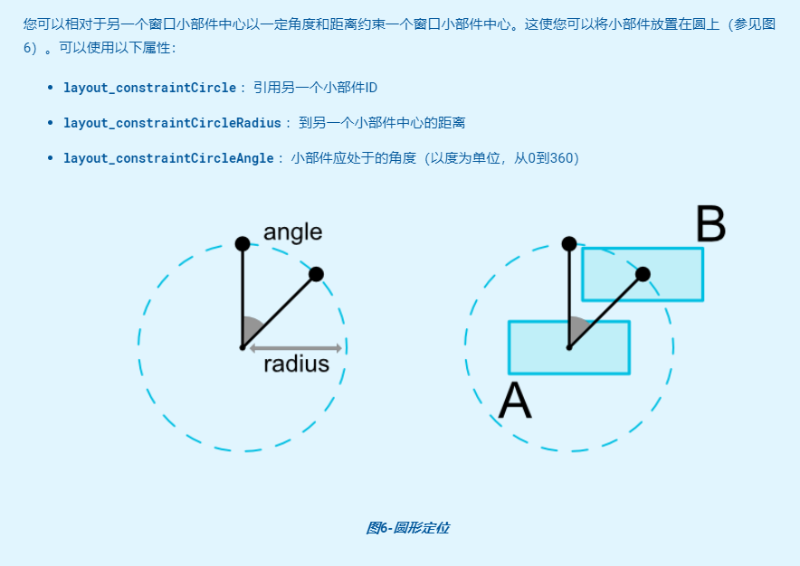
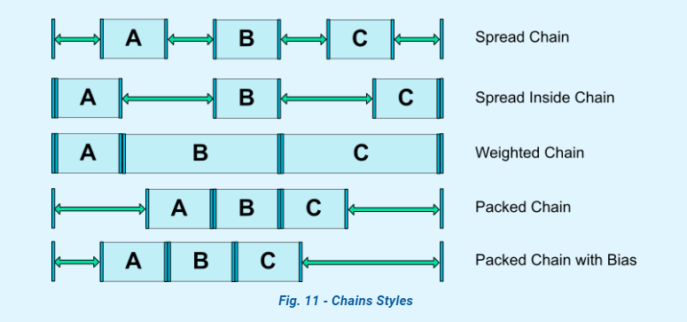

# ConstaintLayout

## group 特性

~~~xml
<androidx.constraintlayout.widget.ConstraintLayout xmlns:android="http://schemas.android.com/apk/res/android"
        xmlns:app="http://schemas.android.com/apk/res-auto"
        xmlns:tools="http://schemas.android.com/tools"
        android:layout_width="match_parent"
        android:layout_height="match_parent"
        tools:context=".group.GroupActivity">

    <androidx.constraintlayout.widget.Group
            android:id="@+id/group"
            android:layout_width="wrap_content"
            android:layout_height="wrap_content"
            android:visibility="visible"
            app:constraint_referenced_ids="button1,button2" />

    <Button
            android:id="@+id/button1"
            android:layout_width="wrap_content"
            android:layout_height="wrap_content"
            android:layout_marginTop="80dp"
            android:text="@string/button1"
            app:layout_constraintEnd_toStartOf="@+id/button2"
            app:layout_constraintHorizontal_bias="0.5"
            app:layout_constraintStart_toStartOf="parent"
            app:layout_constraintTop_toTopOf="parent" />

    <Button
            android:id="@+id/button2"
            android:layout_width="wrap_content"
            android:layout_height="wrap_content"
            android:text="@string/button2"
            app:layout_constraintBottom_toBottomOf="@+id/button1"
            app:layout_constraintEnd_toEndOf="parent"
            app:layout_constraintHorizontal_bias="0.5"
            app:layout_constraintStart_toEndOf="@+id/button1"
            app:layout_constraintTop_toTopOf="@+id/button1" />

    <Button
            android:id="@+id/bt_hide"
            android:layout_width="wrap_content"
            android:layout_height="wrap_content"
            android:layout_marginStart="8dp"
            android:layout_marginEnd="8dp"
            android:layout_marginBottom="8dp"
            android:text="@string/hide_button"
            app:layout_constraintBottom_toBottomOf="parent"
            app:layout_constraintEnd_toEndOf="parent"
            app:layout_constraintStart_toStartOf="parent" />

    <Button
            android:id="@+id/bt_show"
            android:layout_width="wrap_content"
            android:layout_height="wrap_content"
            android:layout_marginBottom="8dp"
            android:text="@string/show_button"
            app:layout_constraintBottom_toTopOf="@+id/bt_hide"
            app:layout_constraintEnd_toEndOf="@+id/bt_hide"
            app:layout_constraintStart_toStartOf="@+id/bt_hide" />

</androidx.constraintlayout.widget.ConstraintLayout>

~~~
可以看到ConstraintLayout里面的声明一个androidx.constraintlayout.widget.Group，然后把所有的控件的id通过constraint_referenced_ids（,隔开）来添加作为组的，然后他们同进退

可以理解为Group的show他们都show,hide他们都hide

## barrier 边界

~~~xml
<?xml version="1.0" encoding="utf-8"?>
<androidx.constraintlayout.widget.ConstraintLayout xmlns:android="http://schemas.android.com/apk/res/android"
        xmlns:app="http://schemas.android.com/apk/res-auto"
        xmlns:tools="http://schemas.android.com/tools"
        android:layout_width="match_parent"
        android:layout_height="match_parent"
        tools:context=".barrier.BarrierActivity">

    <TextView
            android:id="@+id/textView"
            android:layout_width="0dp"
            android:layout_height="wrap_content"
            android:text="显示内容1显示内容1显示内容1显示内容1显示内容1显示内容1显示内容1显示内容1"
            app:layout_constraintBottom_toTopOf="@+id/textView2"
            app:layout_constraintEnd_toEndOf="@+id/textView2"
            app:layout_constraintHorizontal_bias="1.0"
            app:layout_constraintStart_toStartOf="@+id/textView2"
            app:layout_constraintTop_toTopOf="parent"
            app:layout_constraintVertical_chainStyle="spread" />

    <TextView
            android:id="@+id/textView2"
            android:layout_width="120dp"
            android:layout_height="wrap_content"
            android:layout_marginEnd="8dp"
            android:text="显示内容显示内容显示内容显示内容显示内容显示内容2"
            app:layout_constraintBottom_toBottomOf="parent"
            app:layout_constraintEnd_toEndOf="@+id/barrier"
            app:layout_constraintHorizontal_bias="1.0"
            app:layout_constraintStart_toStartOf="parent"
            app:layout_constraintTop_toBottomOf="@+id/textView" />

    <androidx.constraintlayout.widget.Barrier
            android:id="@+id/barrier"
            android:layout_width="wrap_content"
            android:layout_height="wrap_content"
            app:barrierDirection="right"
            app:constraint_referenced_ids="textView,textView2" />

    <TextView
            android:id="@+id/textView3"
            android:layout_width="wrap_content"
            android:layout_height="wrap_content"
            android:layout_marginStart="10dp"
            android:layout_marginEnd="16dp"
            android:text="显示内容3"
            app:layout_constraintBottom_toTopOf="@+id/textView4"
            app:layout_constraintEnd_toEndOf="parent"
            app:layout_constraintStart_toEndOf="@+id/barrier"
            app:layout_constraintTop_toTopOf="parent" />

    <TextView
            android:id="@+id/textView4"
            android:layout_width="wrap_content"
            android:layout_height="wrap_content"
            android:text="显示内容4"
            app:layout_constraintBottom_toBottomOf="parent"
            app:layout_constraintEnd_toEndOf="@+id/textView3"
            app:layout_constraintStart_toStartOf="@+id/textView3"
            app:layout_constraintTop_toBottomOf="@+id/textView3" />

</androidx.constraintlayout.widget.ConstraintLayout>

~~~
如果你有需求是设置里面的那种的话，可以加上一个barrier，然左边固定一个固定位置，然后右边固定一个固定位置，然后都与barrier约束好就行了，在也不用想设置多少距离啥的

用法也差不多，将需要放在一起的挨着边界的id通过constraint_referenced_ids配置到Barrier

## layer

你想没有想过当你要对一些组件执行相同动画的时候（方法缩小等）然后使用约束布局的话可能要写多个view.animal().start(),然后觉得很慢反，现在好了有layer就可以了

~~~xml
<?xml version="1.0" encoding="utf-8"?>
<androidx.constraintlayout.widget.ConstraintLayout xmlns:android="http://schemas.android.com/apk/res/android"
        xmlns:app="http://schemas.android.com/apk/res-auto"
        xmlns:tools="http://schemas.android.com/tools"
        android:layout_width="match_parent"
        android:layout_height="match_parent"
        tools:context=".layer.LayerActivity">

    <androidx.constraintlayout.helper.widget.Layer
            android:id="@+id/layer"
            android:layout_width="wrap_content"
            android:layout_height="wrap_content"
            android:background="#ff0077"
            app:constraint_referenced_ids="button1,button2,button3,button4"
            app:layout_constraintBottom_toBottomOf="parent"
            app:layout_constraintEnd_toEndOf="parent"
            app:layout_constraintStart_toStartOf="parent"
            app:layout_constraintTop_toTopOf="parent" />

    <Button
            android:id="@+id/button1"
            android:layout_width="wrap_content"
            android:layout_height="wrap_content"
            android:layout_marginStart="88dp"
            android:layout_marginTop="256dp"
            android:text="Button1"
            app:layout_constraintStart_toStartOf="parent"
            app:layout_constraintTop_toTopOf="parent" />

    <Button
            android:id="@+id/button2"
            android:layout_width="wrap_content"
            android:layout_height="wrap_content"
            android:text="Button2"
            app:layout_constraintBottom_toBottomOf="@+id/button1"
            app:layout_constraintEnd_toEndOf="@+id/button4"
            app:layout_constraintStart_toStartOf="@+id/button4"
            app:layout_constraintTop_toTopOf="@+id/button1" />

    <Button
            android:id="@+id/button3"
            android:layout_width="wrap_content"
            android:layout_height="wrap_content"
            android:layout_marginTop="8dp"
            android:layout_marginBottom="8dp"
            android:text="Button3"
            app:layout_constraintBottom_toBottomOf="parent"
            app:layout_constraintEnd_toEndOf="@+id/button1"
            app:layout_constraintStart_toStartOf="@+id/button1"
            app:layout_constraintTop_toBottomOf="@+id/button1" />

    <Button
            android:id="@+id/button4"
            android:layout_width="wrap_content"
            android:layout_height="wrap_content"
            android:layout_marginStart="8dp"
            android:layout_marginEnd="8dp"
            android:text="Button4"
            app:layout_constraintBottom_toBottomOf="@+id/button3"
            app:layout_constraintEnd_toEndOf="parent"
            app:layout_constraintStart_toEndOf="@+id/button3"
            app:layout_constraintTop_toTopOf="@+id/button3"
            app:layout_constraintVertical_bias="0.0" />

    <Button
            android:id="@+id/button6"
            android:layout_width="wrap_content"
            android:layout_height="wrap_content"
            android:layout_marginStart="8dp"
            android:layout_marginEnd="8dp"
            android:layout_marginBottom="8dp"
            android:text="执行动画"
            app:layout_constraintBottom_toBottomOf="parent"
            app:layout_constraintEnd_toEndOf="parent"
            app:layout_constraintStart_toStartOf="parent" />
</androidx.constraintlayout.widget.ConstraintLayout>
~~~
案例
~~~kotlin
 button6.setOnClickListener {
            val valueAnimator = ValueAnimator.ofFloat(0F, 360F)
            valueAnimator.duration = 300
            valueAnimator.addUpdateListener {
                val value = it.animatedValue as Float
                layer.rotation = value
                layer.scaleX = 1 + (180 - Math.abs(value - 180)) / 20f
                layer.scaleY = 1 + (180 - Math.abs(value - 180)) / 20f
                var shift_x = 500 * Math.sin(Math.toRadians((value * 5).toDouble())).toFloat()
                var shift_y = 500 * Math.sin(Math.toRadians((value * 7).toDouble())).toFloat()
                layer.translationX = shift_x
                layer.translationY = shift_y
            }
            valueAnimator.duration = 4000
            valueAnimator.start()
        }

~~~
要执行相同属性或者啥的，把你需要执行的id放在layer里面去，然后对layer执行相同的，然后每个空间都会按照这样去执行

把id使用属性constraint_referenced_ids添加到Layer

## ConstraintHelper 上面的Layer Barrier Group都是继承这个的

自定义ConstraintHelper

~~~kotlin
class CircularRevealHelper:ConstraintHelper {
    constructor(context: Context): super(context)

    constructor(context: Context, attrs: AttributeSet): super(context, attrs)

    constructor(context: Context, attrs: AttributeSet, defStyleAttr: Int) : super(context, attrs, defStyleAttr)

    override fun updatePostLayout(container: ConstraintLayout?) {
        super.updatePostLayout(container)
        if (Build.VERSION.SDK_INT >= Build.VERSION_CODES.LOLLIPOP) {
            for (i in 0 until this.mCount) {
                val id = this.mIds[i]//就是我们添加到里面的id
                val view = container?.getViewById(id)
                if (view != null) {
                    val valueAnimator = ValueAnimator.ofFloat(0f, 2f)
                    valueAnimator.addUpdateListener {
                        val value = it.animatedValue as Float
                        view.scaleX =value
                        view.scaleY =value
                    }
                    valueAnimator.duration = 5000
                    valueAnimator.start()
                }
            }
        }

    }
}

~~~
其实也是通过ConstraintLayoutHelper里面的mCount来知道他的view绑定的个数，然后findViewById来获取view然后执行相应的操作(看过layer的源码也差不多)
xml布局

~~~xml
<androidx.constraintlayout.widget.ConstraintLayout
        xmlns:android="http://schemas.android.com/apk/res/android"
        xmlns:tools="http://schemas.android.com/tools"
        xmlns:app="http://schemas.android.com/apk/res-auto"
        android:layout_width="match_parent"
        android:layout_height="match_parent"
        tools:context=".layer.LayerActivity">
    <ImageView
            android:id="@+id/img_test"
            android:layout_width="200dp"
            android:layout_height="200dp"
            app:layout_constraintBottom_toBottomOf="parent"
            app:layout_constraintEnd_toEndOf="parent"
            app:layout_constraintStart_toStartOf="parent"
            app:layout_constraintTop_toTopOf="parent"
            app:srcCompat="@drawable/test" app:layout_constraintHorizontal_bias="0.5"
            app:layout_constraintVertical_bias="0.499"/>
    <com.yj.constraintlayout20.layer.helper.CircularRevealHelper
            android:layout_width="wrap_content"
            android:id="@+id/layer_self"
            tools:ignore="MissingConstraints"
            app:constraint_referenced_ids="img_test"
            android:layout_height="wrap_content"/>
</androidx.constraintlayout.widget.ConstraintLayout>

~~~
这样我们就可以定制型的给我们想要的组件执行相应的设置一些动画或者属性了

## 连接到GONE小部件时的边距

连接到的小部件当为gone的时候设置的边距

- layout_goneMarginStart 
- layout_goneMarginEnd
- layout_goneMarginLeft
- layout_goneMarginTop
- layout_goneMarginRight
- layout_goneMarginBottom

这里就用goneMarginTop作为例子
~~~xml
<?xml version="1.0" encoding="utf-8"?>
<androidx.constraintlayout.widget.ConstraintLayout xmlns:android="http://schemas.android.com/apk/res/android"
        xmlns:app="http://schemas.android.com/apk/res-auto"
        xmlns:tools="http://schemas.android.com/tools"
        android:layout_width="match_parent"
        android:layout_height="match_parent"
        tools:context=".gone_margin.GoneMarginActivity">

    <Button
            android:id="@+id/button"
            android:layout_width="wrap_content"
            android:layout_height="wrap_content"
            android:layout_marginBottom="10dp"
            android:text="显示"
            app:layout_constraintBottom_toBottomOf="parent"
            app:layout_constraintEnd_toStartOf="@+id/button5"
            app:layout_constraintHorizontal_bias="0.5"
            app:layout_constraintStart_toStartOf="parent" />

    <Button
            android:id="@+id/button5"
            android:layout_width="wrap_content"
            android:layout_height="wrap_content"
            android:layout_marginBottom="10dp"
            android:text="隐藏"
            app:layout_constraintBottom_toBottomOf="parent"
            app:layout_constraintEnd_toEndOf="parent"
            app:layout_constraintHorizontal_bias="0.5"
            app:layout_constraintStart_toEndOf="@+id/button" />

    <TextView
            android:id="@+id/textView5"
            android:layout_width="wrap_content"
            android:layout_height="wrap_content"
            android:layout_marginTop="50dp"
            android:text="需要显示和隐藏的内容"
            app:layout_constraintEnd_toEndOf="parent"
            app:layout_constraintStart_toStartOf="parent"
            app:layout_constraintTop_toTopOf="parent" />

    <TextView
            android:id="@+id/textView6"
            android:layout_width="wrap_content"
            android:layout_height="wrap_content"
            android:layout_marginTop="20dp"
            app:layout_goneMarginTop="200dp"
            android:text="去约束要隐藏的一个空间"
            android:textSize="16dp"
            android:textColor="#ff0077"
            app:layout_constraintEnd_toEndOf="parent"
            app:layout_constraintStart_toStartOf="parent"
            app:layout_constraintTop_toBottomOf="@+id/textView5" />
</androidx.constraintlayout.widget.ConstraintLayout>

~~~

## 中心约束

您可以相对于另一个窗口小部件中心以一定角度和距离约束一个窗口小部件中心。这使您可以将小部件放置在圆上

~~~xml

 <androidx.constraintlayout.widget.ConstraintLayout
            android:layout_width="match_parent"
            android:layout_height="match_parent">

        <androidx.appcompat.widget.AppCompatImageView
                android:id="@+id/img_circle1"
                app:layout_constraintStart_toStartOf="parent"
                app:layout_constraintEnd_toEndOf="parent"
                app:layout_constraintTop_toTopOf="parent"
                app:layout_constraintBottom_toBottomOf="parent"
                android:src="@mipmap/ic_launcher"
                android:layout_width="50dp"
                android:layout_height="50dp" />

        <androidx.appcompat.widget.AppCompatImageView
                android:id="@+id/img_circle2"
                android:layout_width="50dp"
                android:layout_height="50dp"
                android:background="#ff0077"
                app:layout_constraintCircle="@+id/img_circle1"
                app:layout_constraintCircleAngle="45"
                app:layout_constraintCircleRadius="50dp"
                tools:layout_editor_absoluteX="241dp"
                tools:layout_editor_absoluteY="166dp"
                tools:ignore="MissingConstraints" />
    </androidx.constraintlayout.widget.ConstraintLayout>
~~~

## 比例 layout_constraintDimensionRatio

    如果两个尺寸都设置为MATCH_CONSTRAINT（0dp），也可以使用比率。在这种情况下，系统将设置满足所有约束并维持指定长宽比的最大尺寸。
    要基于另一侧的尺寸来约束一个特定的侧面，可以预先附加W,“”或H,分别约束宽度或高度。
    例如，如果一个尺寸受两个目标约束（例如，宽度为0dp且以父对象为中心），则可以指定通过 在比率的前面添加字母W（用于约束宽度）或H（用于约束高度）来约束哪一侧，并用逗号分隔：
~~~xml
 <Button android:layout_width="0dp"
         android:layout_height="0dp"
         app:layout_constraintDimensionRatio="H,16:9"
         app:layout_constraintBottom_toBottomOf="parent"
         app:layout_constraintTop_toTopOf="parent"/>
~~~

## Chains 

- Chain Style

使用layout_constraintHorizontal_weight 和 layout_constraintVertical_weight进行权重管理

使用layout_constraintHorizontal_chainStyle进行样式管理（spread_inside（分散到两边），spread（默认）,packed(挨着一起)）

